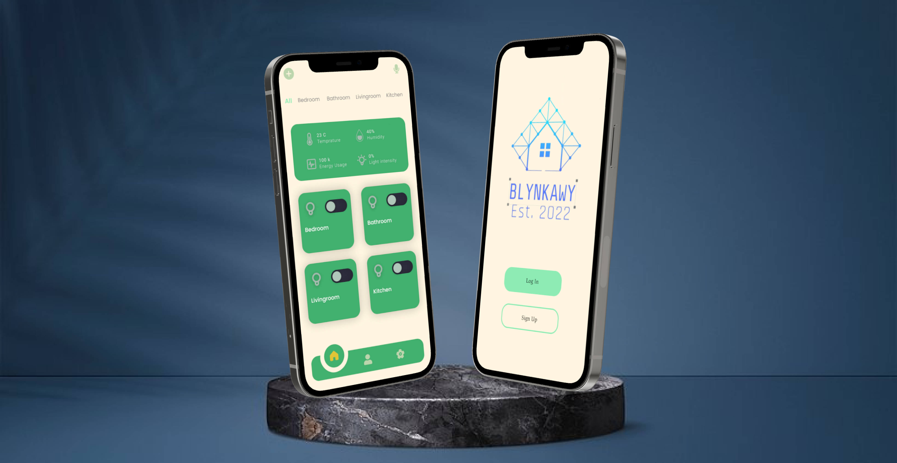

# Blynkawy

**Blynkawy** is a smart home application developed using Flutter. It allows users to control and monitor their smart home devices seamlessly. The app offers a user-friendly interface, secure authentication, and real-time updates to enhance your smart home experience.

## Features

- **Device Control**: Control various smart home devices such as lights, thermostats, and security cameras.
- **Real-Time Monitoring**: Monitor the status of your devices in real-time.
- **Secure Authentication**: Ensure the security of your data with secure login and authentication.
- **Integrated-AI**: Has Object detection AI model that help identifing the objects

## Usage

Once the app is installed and running, you can start adding and controlling your smart home devices. The user interface is designed to be intuitive, with clearly labeled buttons and options for each device type.

## Contact

For any inquiries or support, please contact us at [youssefaymanmoghamed1@gmail.com](mailto:youssefaymanmoghamed1@gmail.com) and [begadtamim.a@gmail.com](mailto:begadtamim.a@gmail.com).

## Mockup 

